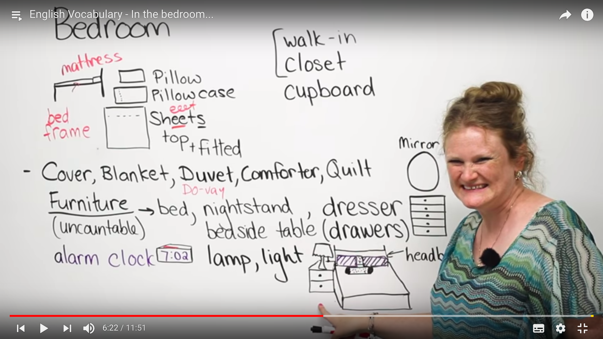

# bedroom

## Pillow

n. 枕头

## Pillow case

n. 枕巾

## Sheets

n. 床单

## mattress

n. 床垫

## bed frame

床架

## comforter

n. 棉被

## quilt

n. 被子

## duvet

n. 羽绒被

## blanket

n. 毯子

## nightstand

n. 床头柜

**nightstand = bedside table**

## dresser

n. 梳妆台

**dresser = drawers**

## drawer

n. 抽屉

## mirror

n. 镜子

## alarm clock

n. 闹钟

## capboard

n. 橱柜

## lamp

n. 灯

## light

adj. 轻的，浅的

> having a considerable or sufficient amount of natural light.

n. 灯，光，亮

> the nature agent that stimulates sight and makes things visible.

v. 点燃

> provide with light or lighting.

